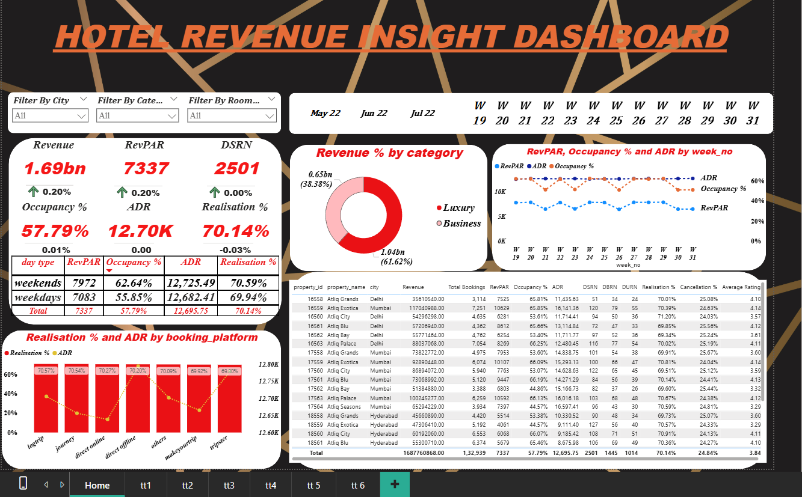
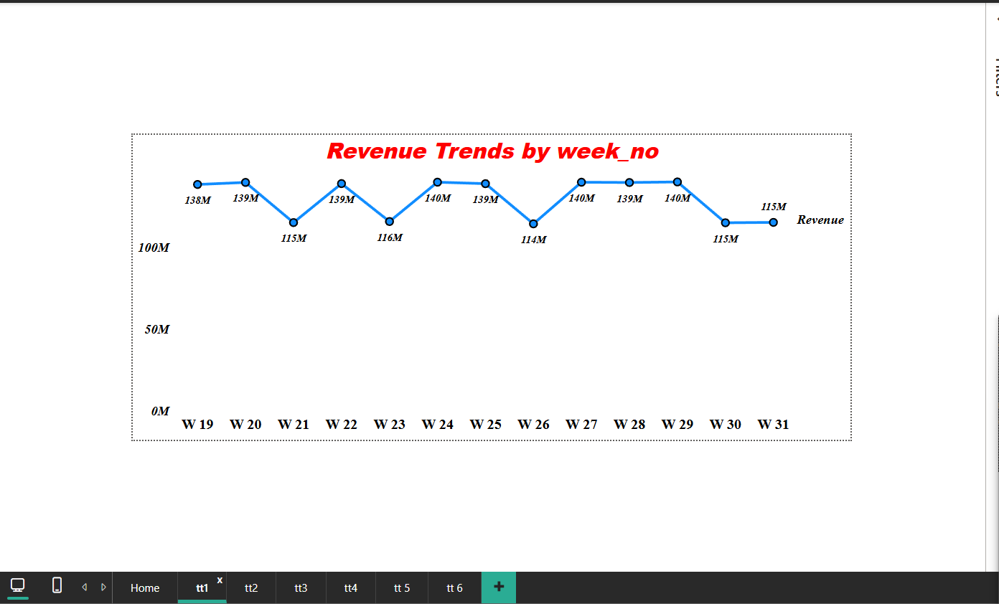
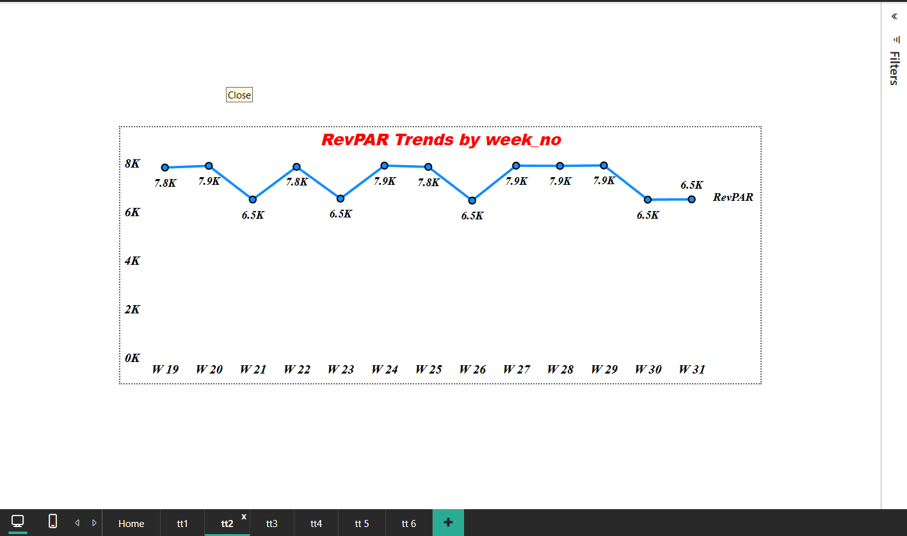
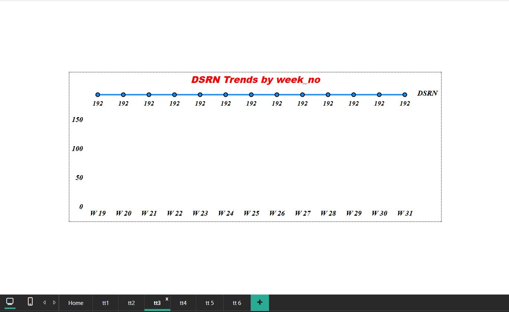
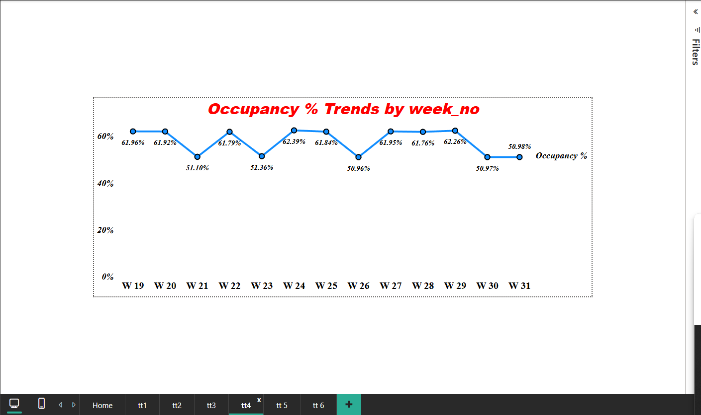
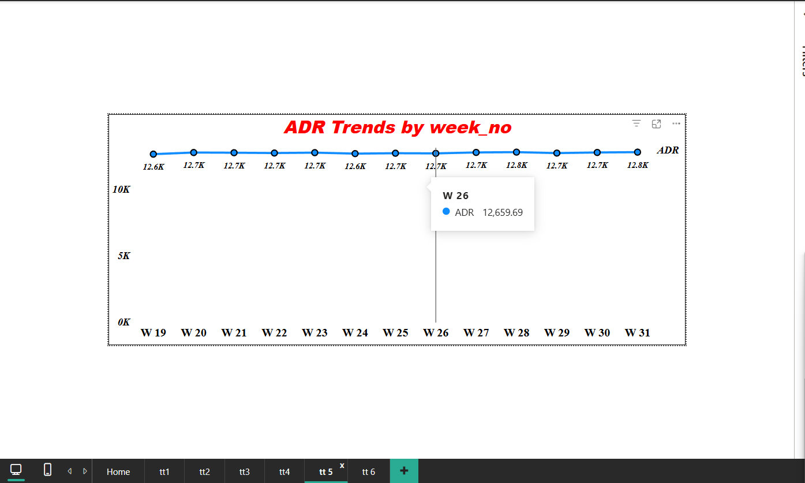
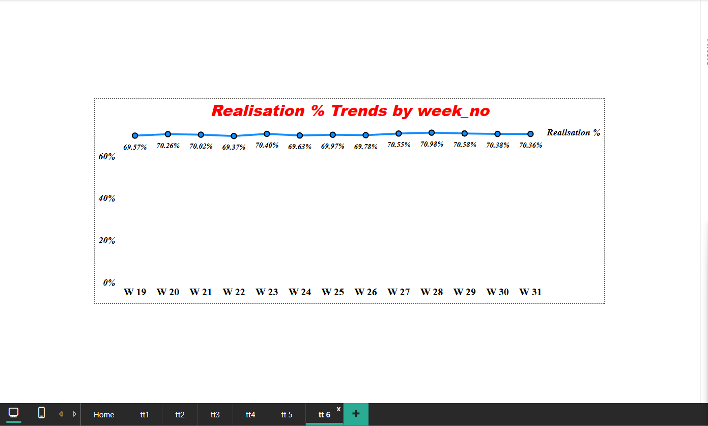

# 🏨 Hotel Revenue Analytics Dashboard — AtliQ Hotels

> **MySQL · Power BI · DAX · Star Schema · 1,34,590 Bookings**

An end-to-end hospitality analytics project built on AtliQ Hotels data covering **revenue, occupancy, ADR, RevPAR, and cancellations** across 25 properties in 4 cities. Includes a 7-page interactive Power BI dashboard with week-over-week KPI tracking.

---

## 📸 Dashboard Preview

### 🏠 Home — Revenue Insight Dashboard


### 📈 KPI Trend Pages







---

## 📁 Repository Structure
hotel-analytics/
├── hotel_analytics.sql           # MySQL queries & schema
├── fact_bookings.csv             # 1,34,590 booking records
├── fact_aggregated_bookings.csv
├── dim_hotels.csv                # 25 properties
├── dim_rooms.csv                 # 4 room types
├── dim_date.csv                  # 92 days (May–Jul 2022)
├── hotel_dashboard.pbix          # Power BI dashboard
└── README.md

---

## 📊 Key KPIs & Results

| KPI | Value |
|-----|-------|
| Total Revenue | ₹1.69 Billion |
| RevPAR | ₹7,337 |
| ADR | ₹12,695 |
| Occupancy % | 57.79% |
| Realisation % | 70.14% |
| Cancellation Rate | 24.84% |
| DSRN | 2,501 |

| | RevPAR | Occupancy % | ADR |
|--|--|--|--|
| Weekends | 7,972 | 62.64% | 12,725 |
| Weekdays | 7,083 | 55.85% | 12,682 |

---

## 🏗️ Data Model — Star Schema
fact_bookings (134K rows)
├── dim_hotels     (property_id → 25 hotels, 4 cities)
├── dim_rooms      (room_id → 4 room types)
└── dim_date       (check_in_date → 92 days)
fact_aggregated_bookings
├── dim_hotels
├── dim_rooms
└── dim_date

---

## 🧮 Key DAX Measures

```dax
Revenue       = SUM(fact_bookings[revenue_realized])
RevPAR        = DIVIDE([Revenue], [DSRN])
ADR           = DIVIDE([Revenue], [Total Bookings])
Occupancy %   = DIVIDE([DURN], [DSRN])
Realisation % = DIVIDE([DURN], [DBRN])
Cancellation% = DIVIDE([Cancelled Bookings], [Total Bookings])

WoW Revenue % =
DIVIDE(
    [Revenue] - CALCULATE([Revenue], DATEADD(dim_date[date], -7, DAY)),
    CALCULATE([Revenue], DATEADD(dim_date[date], -7, DAY))
)
```

---

## 💡 Key Business Insights

- **Luxury segment** drives 61.62% of total revenue despite fewer properties
- **Mumbai** highest revenue city; **Delhi** highest average rating (4.10)
- **24.84% cancellation rate** — 1 in 4 bookings cancelled, major revenue leakage
- **Weekends** outperform weekdays on all KPIs — RevPAR 12.5% higher
- **MakeYourTrip & LogTrip** are top booking platforms by volume
- **DSRN flat at 192/week** — supply is fixed, growth must come from ADR/Occupancy

---

## ⚙️ Setup Instructions

**MySQL:**
1. Run `hotel_analytics.sql` in MySQL Workbench
2. Import CSVs using `LOAD DATA LOCAL INFILE`

**Power BI:**
1. Open `hotel_dashboard.pbix` in Power BI Desktop
2. Update data source path if needed → Refresh

---

## 🙋 Author

**Nikhilesh Chouhan** · [GitHub](https://github.com/nikhileshh02)
